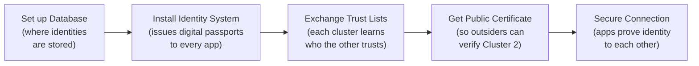
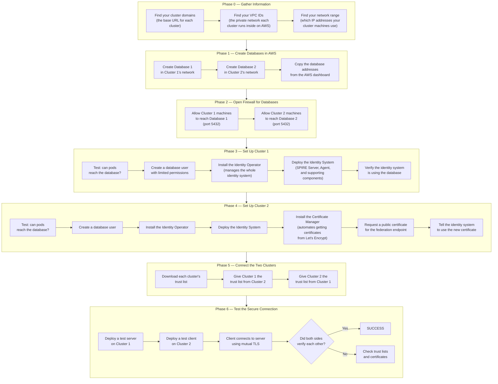
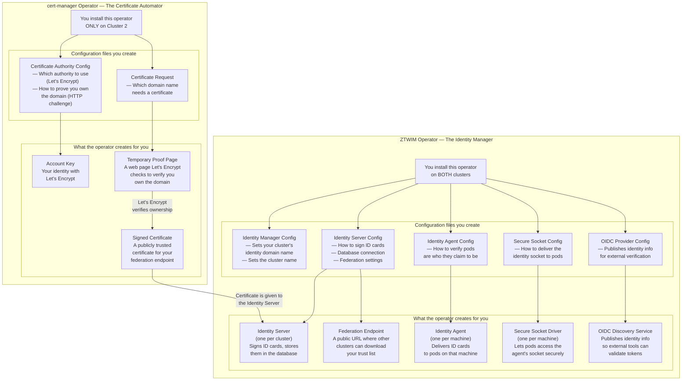
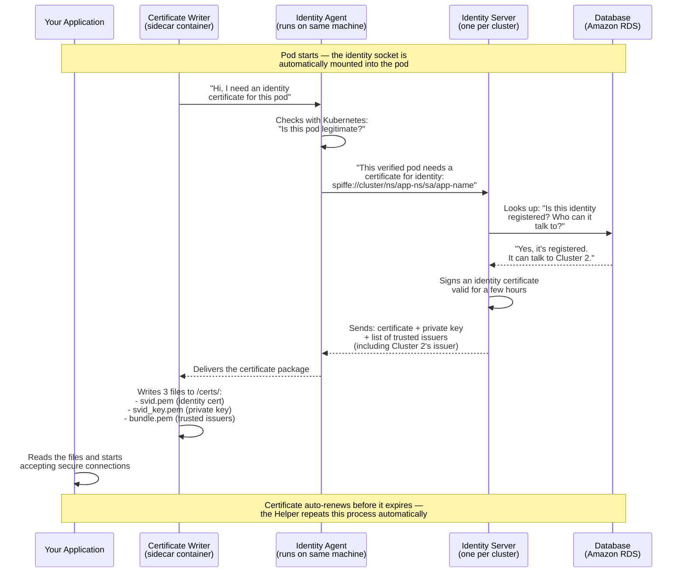
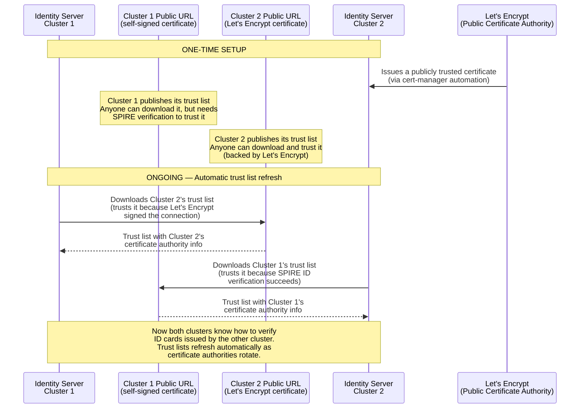
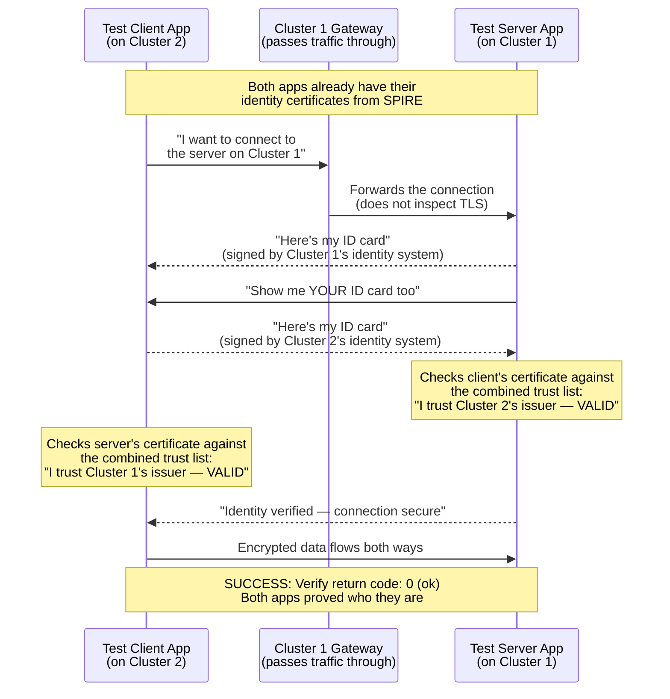
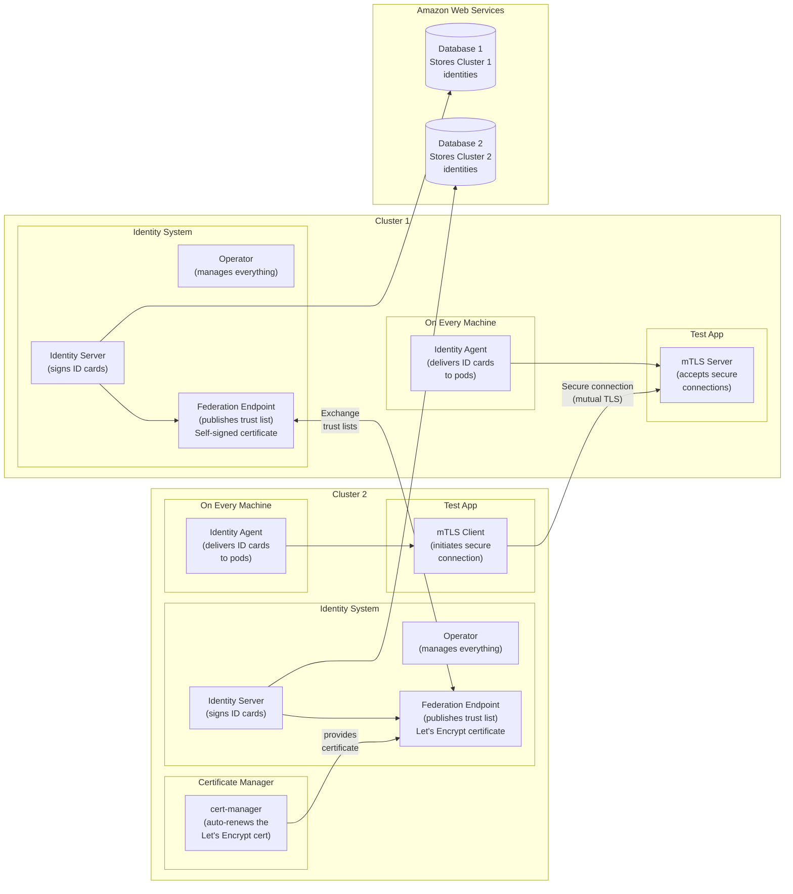

# SPIFFE Federation — Visual Guide for Beginners

A beginner-friendly visual reference for the SPIFFE cross-cluster federation setup using Amazon RDS PostgreSQL, the ZTWIM Operator, cert-manager, and Let's Encrypt.

> **Reading tip**: Every section starts with a plain-English explanation before the diagram. If a technical term appears, it is explained inline in parentheses.

---

## 1. The Big Picture

**Goal**: Two separate OpenShift clusters need to **trust each other** so that an application on Cluster 1 can securely communicate with an application on Cluster 2 — and both sides can verify "yes, I'm really talking to who I think I'm talking to."

Think of it like **two companies that want their employees to visit each other's offices**. Each company:
1. Sets up an **ID card system** (SPIRE) that issues digital passports to every employee (application pod)
2. Stores the employee registry in a **secure database** (Amazon RDS PostgreSQL)
3. **Exchanges their list of trusted ID issuers** with the other company (federation)
4. One company gets their trust list **notarized by a public authority** (Let's Encrypt via cert-manager) so anyone can verify it without special setup

The end result: an app on Cluster 2 shows its ID card to an app on Cluster 1, Cluster 1 checks the card against the trusted issuer list, and the secure connection is established.

---

## 2. End-to-End Setup Flow

> **What this shows**: The step-by-step order of everything you do, from creating databases in AWS all the way to testing the secure connection. Each box is one action, grouped by where you perform it.

---

## 3. What Each Operator Does and Why

> **What is an Operator?** An Operator is a piece of software that runs inside OpenShift and automates a complex task. You tell it *what* you want (by creating a configuration file called a CRD), and the Operator figures out *how* to make it happen — installing software, configuring it, and keeping it running.

### The Two Operators in This Setup

### Why Each Operator Matters

| Operator | Installed On | What It Does (Plain English) | Real-World Analogy | What Breaks Without It |
|----------|-------------|-------|--------|----------------------|
| **ZTWIM Operator** | Both clusters | Installs and manages the entire identity system — the server that signs ID cards, the agents that deliver them, and the federation endpoint | Like an **HR department** that issues employee badges, keeps the employee directory updated, and handles badge verification | No identity system exists at all; no pods get ID cards, no federation is possible |
| **cert-manager** | Cluster 2 only | Automatically requests, validates, and renews a publicly trusted certificate from Let's Encrypt | Like hiring a **notary service** that stamps your company's official documents so anyone in the world trusts them | Cluster 2's federation endpoint uses a self-signed certificate; other clusters can't automatically trust it without manual setup |

### What Each Configuration File (CRD) Does

| Configuration File | Which Operator Uses It | What It Does (Plain English) | Analogy |
|-------------------|----------------------|------|---------|
| `ZeroTrustWorkloadIdentityManager` | ZTWIM | Sets the identity domain name for your cluster — this is the "company name" on every ID card | Registering your **company name** with the government |
| `SpireServer` | ZTWIM | Configures the identity server: how to sign cards, where to store data (your RDS database), and how to share trust with other clusters | Setting up the **badge printing machine** and connecting it to the employee database |
| `SpireAgent` | ZTWIM | Configures how each machine verifies that a pod is legitimate before giving it an ID card | Training the **security guard** on each floor to check IDs before handing out badges |
| `SpiffeCSIDriver` | ZTWIM | Lets application pods securely access the identity agent's socket (communication channel) | Installing a **badge reader slot** in every office door |
| `SpireOIDCDiscoveryProvider` | ZTWIM | Publishes identity information so external tools (outside the cluster) can verify tokens | Putting your company's **badge verification hotline number** on a public website |
| `Issuer` | cert-manager | Registers with Let's Encrypt and defines how to prove you own the domain | Opening an **account with the notary service** and agreeing on the verification method |
| `Certificate` | cert-manager | Requests a specific certificate for a specific domain name | Submitting a **notarization request** for a specific document |
| `ClusterSPIFFEID` | ZTWIM (SPIRE) | Rules for which pods get which ID cards, and which other clusters they're allowed to talk to | The **employee directory entry** — "John in Engineering can visit Building B" |
| `ClusterFederatedTrustDomain` | ZTWIM (SPIRE) | Tells your cluster to trust another cluster — provides the other cluster's trust list and how to refresh it | Adding another company to your **list of trusted partner organizations** |

---

## 4. How a Pod Gets Its Identity (Step by Step)

> **What this shows**: When an application pod starts up, it needs an identity certificate (a "digital passport") to prove who it is. This diagram shows the exact sequence of events from pod startup to the app being ready for secure communication.

---

## 5. How Two Clusters Learn to Trust Each Other

> **What this shows**: Before apps can talk across clusters, each cluster needs the other's "list of trusted issuers." This is called **federation**. Think of it as two companies exchanging their official stamp samples so security guards at each company can verify badges from the other.

### Why Two Different Methods?

| | Cluster 1 (https_spiffe) | Cluster 2 (https_web) |
|--|--------------------------|----------------------|
| **Certificate type** | Self-signed by SPIRE | Signed by Let's Encrypt (publicly trusted) |
| **How others verify it** | Must already have SPIRE's certificate to trust it | Any system trusts it automatically (like HTTPS on websites) |
| **Setup effort** | None (built-in) | Requires cert-manager + Let's Encrypt |
| **Why use it** | Simple, works cluster-to-cluster | Demonstrates production-grade trust with public certificates |

---

## 6. The Secure Connection Test (mTLS Handshake)

> **What this shows**: The final test — a client app on Cluster 2 connects to a server app on Cluster 1. Both sides prove their identity to each other using their SPIFFE certificates. This is called **mutual TLS (mTLS)** because *both* sides authenticate, not just the server.

---

## 7. What Gets Stored in the Database

> **What this shows**: SPIRE stores all its data in Amazon RDS PostgreSQL instead of a local file. Here's what ends up in the database and why each piece matters.

| Table Name | What It Stores | Plain English | Example |
|-----------|---------------|---------------|---------|
| `bundles` | Certificate authority certificates | The "master stamps" used to sign ID cards — your own + any trusted partner's | 2 entries: Cluster 1's stamp + Cluster 2's stamp |
| `registered_entries` | Workload identity rules | The list of "who is allowed to get an ID card and what name goes on it" | `mtls-server` pod in the `federation-test` namespace |
| `attested_node_entries` | Verified machines | The list of machines (nodes) that have proven they belong to this cluster | 3 entries: one per worker node, verified via `k8s_psat` |
| `selectors` | Pod matching rules | How SPIRE decides which identity rule applies to which pod (by labels, namespace, service account) | "Any pod with label `spiffe.io/spiffe-id: true` in namespace `federation-test`" |
| `federated_registration_entries` | Cross-cluster permissions | Which workloads are allowed to talk to which other clusters | `mtls-server` is allowed to accept connections from Cluster 2 |
| `federated_trust_domains` | Partner cluster info | Where to download the trust list from each trusted partner cluster | Cluster 2's federation URL + its profile type (`https_web`) |
| `ca_journals` | Key rotation history | A log of when the signing keys were rotated (for security auditing) | Tracks every time SPIRE changed its CA signing key |
| `dns_names` | DNS names for identities | Additional DNS names associated with a workload's identity | DNS names attached to specific registered entries |
| `migrations` | Schema version number | Tracks which database version SPIRE is using (for upgrades) | Version `22` after the latest migration |

---

## 8. What Runs Where — Component Map

> **What this shows**: A bird's-eye view of all the pieces and which cluster or AWS service they run on.

---

## Quick Reference — Jargon Decoder

| Term You'll See | What It Actually Means |
|----------------|----------------------|
| **SPIFFE** | A standard for giving apps their own identity (like a passport standard) |
| **SPIRE** | The software that implements SPIFFE (the passport-issuing office) |
| **SVID** | The actual identity certificate a pod receives (the passport itself) |
| **Trust Domain** | The identity namespace for a cluster (like a country that issues passports) |
| **Trust Bundle** | A list of certificate authorities you trust (list of countries whose passports you accept) |
| **Federation** | Two clusters agreeing to trust each other's identities |
| **mTLS** | Mutual TLS — both client and server prove their identity (both show passports) |
| **ZTWIM Operator** | Zero Trust Workload Identity Manager — the OpenShift operator that manages SPIRE |
| **cert-manager** | An operator that automatically gets and renews TLS certificates |
| **Let's Encrypt** | A free, public certificate authority (like a government that stamps documents for free) |
| **CRD** | Custom Resource Definition — a YAML configuration file you give to OpenShift |
| **StatefulSet** | A way to run exactly one server pod with persistent storage |
| **DaemonSet** | A way to run one copy of a pod on every machine in the cluster |
| **CSI Driver** | Container Storage Interface — securely mounts files/sockets into pods |
| **k8s_psat** | Kubernetes Projected Service Account Token — how SPIRE verifies a pod's identity with Kubernetes |
| **RDS** | Amazon Relational Database Service — a managed PostgreSQL database in the cloud |
| **VPC** | Virtual Private Cloud — an isolated network on AWS (like a private building) |
| **Security Group** | A firewall rule set on AWS that controls who can connect to what |
| **ACME** | Automatic Certificate Management Environment — the protocol Let's Encrypt uses |
| **https_spiffe** | Federation profile where the endpoint uses SPIRE's own self-signed certificate |
| **https_web** | Federation profile where the endpoint uses a publicly trusted certificate |

---

*Companion to: [SPIFFE Federation RDS PostgreSQL Guide](https://github.com/sayak-redhat/redhat-openshift-onboarding/blob/main/SPIFFE-Federation-RDS-PostgreSQL-Guide-4.19.md)*
