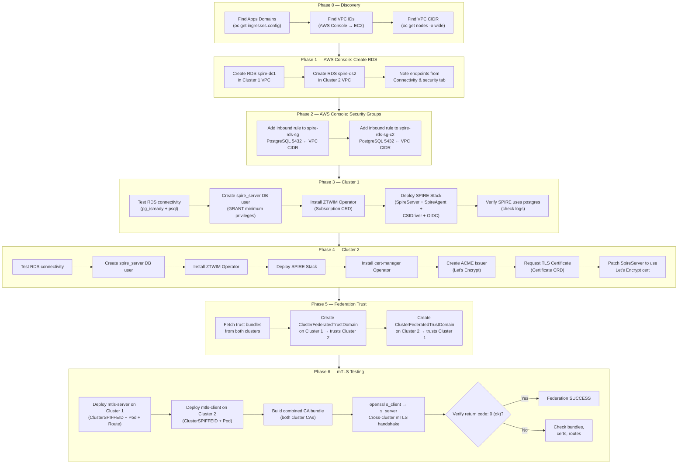
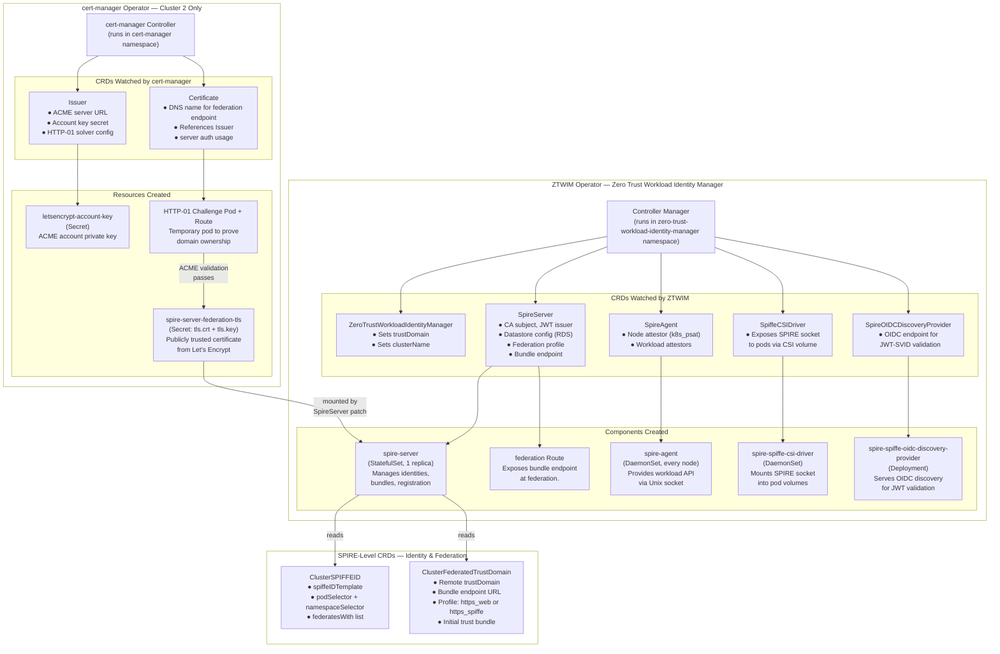
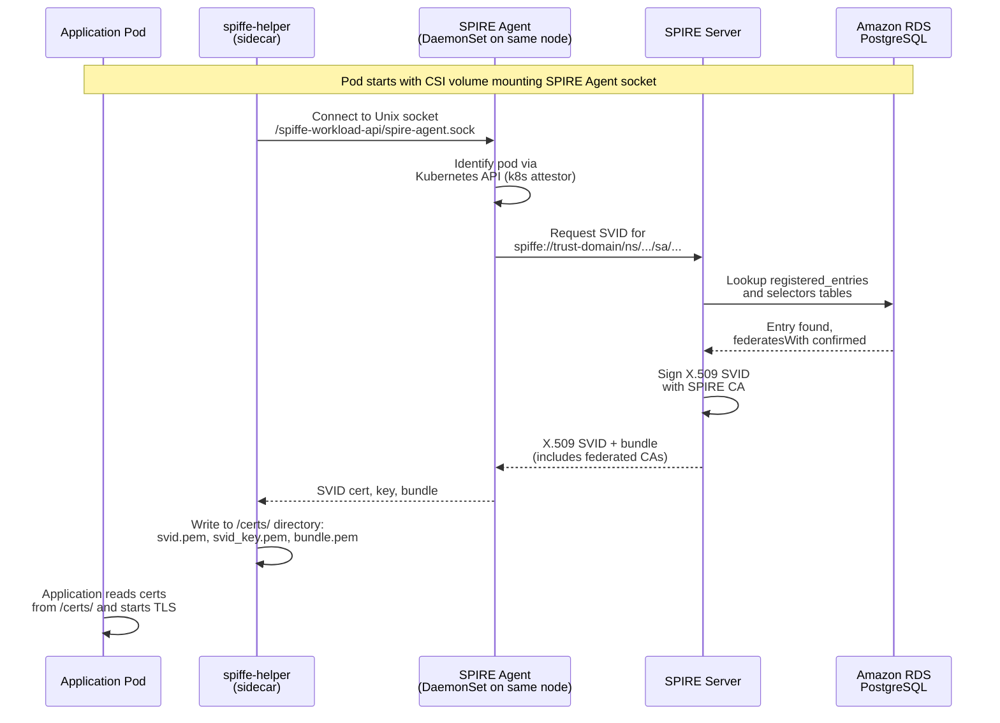
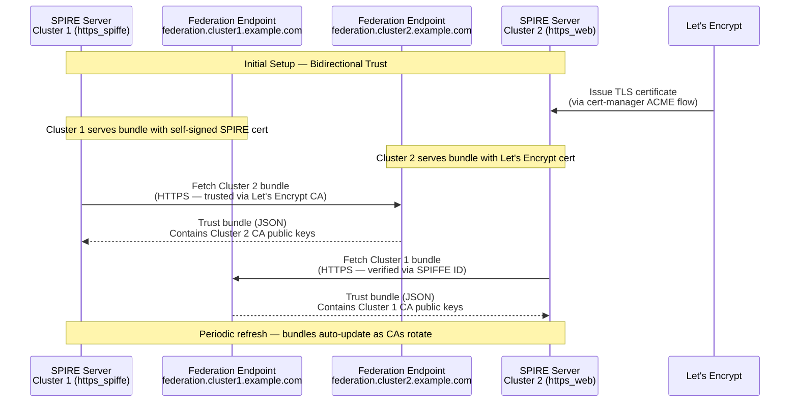
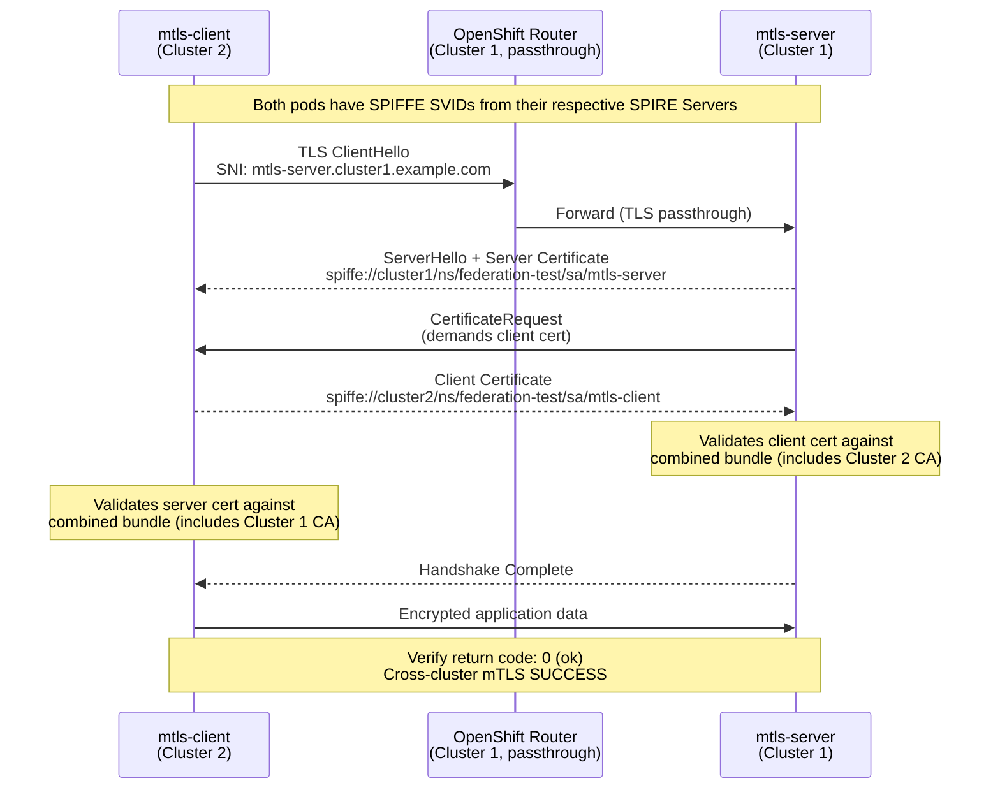
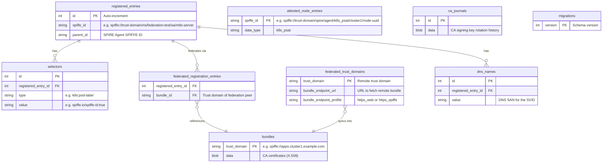
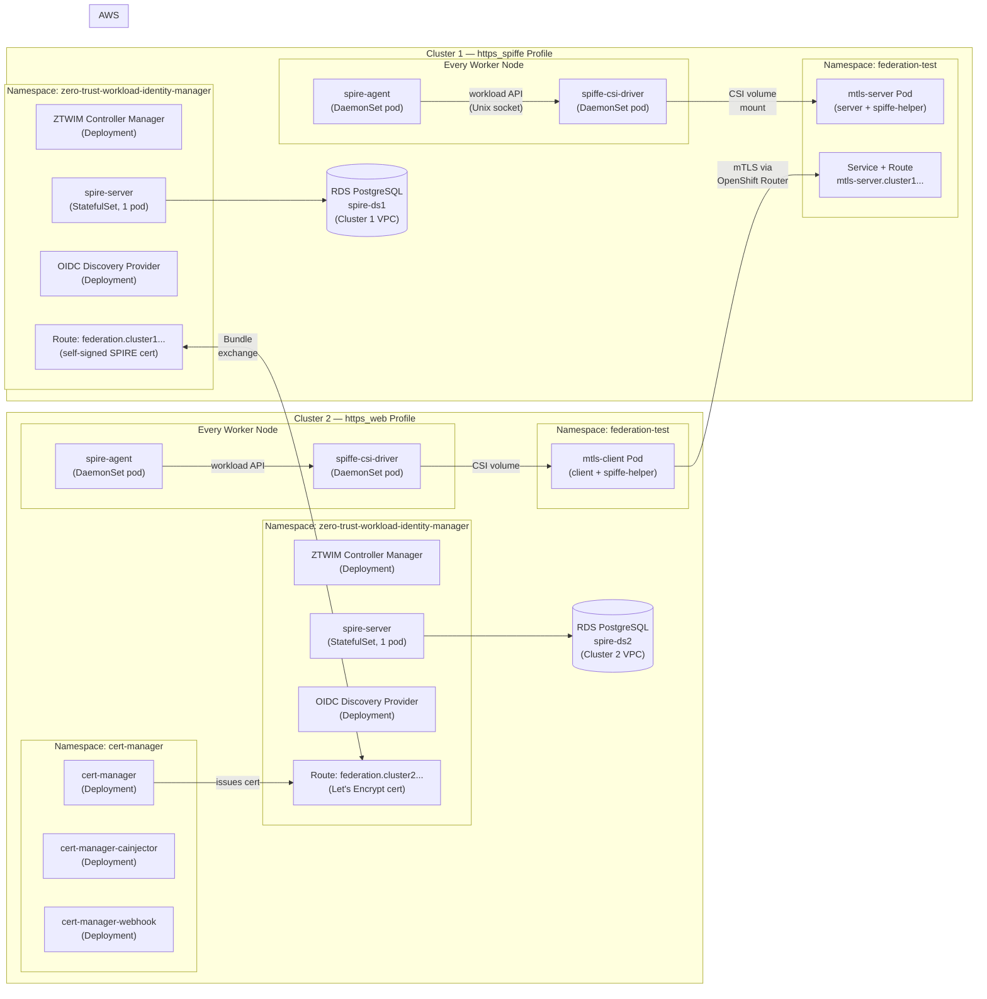

# SPIFFE Federation Flow — Operators, Components & Data Flow

Visual reference for the SPIFFE cross-cluster federation setup using Amazon RDS PostgreSQL, ZTWIM Operator, cert-manager, and Let's Encrypt.

---

## 1. End-to-End Setup Flow

This diagram shows the complete execution order — what runs where, and in what sequence.

---

## 2. Operator and Component Interaction

This diagram shows every operator, the CRDs it watches, the components it creates, and their significance.

### Significance of Each Operator

| Operator | Installed On | Role | What Happens Without It |
|----------|-------------|------|------------------------|
| **ZTWIM Operator** | Both clusters | Manages the entire SPIRE stack lifecycle — installs, configures, and reconciles SPIRE Server, Agent, CSI Driver, and OIDC Provider based on CRDs | No SPIRE components exist; no workload identities, no federation |
| **cert-manager Operator** | Cluster 2 only | Automates TLS certificate lifecycle — requests, validates (HTTP-01), issues, and renews certificates from Let's Encrypt | Cluster 2 cannot use `https_web` profile; federation endpoint would need manual certificate management or fall back to `https_spiffe` |

### Significance of Each CRD

| CRD | Operator | What It Does |
|-----|----------|-------------|
| `ZeroTrustWorkloadIdentityManager` | ZTWIM | Sets the trust domain and cluster name — the identity root for all workloads |
| `SpireServer` | ZTWIM | Configures the SPIRE Server: CA, datastore (RDS connection), federation profile, bundle endpoints |
| `SpireAgent` | ZTWIM | Configures node attestation (k8s_psat) and workload attestation methods |
| `SpiffeCSIDriver` | ZTWIM | Enables pods to mount the SPIRE Agent socket as a CSI volume (no hostPath needed) |
| `SpireOIDCDiscoveryProvider` | ZTWIM | Exposes OIDC discovery endpoint for services that validate JWT-SVIDs |
| `Issuer` | cert-manager | Registers an ACME account with Let's Encrypt and defines the challenge solver |
| `Certificate` | cert-manager | Requests a specific TLS certificate; cert-manager handles the full ACME flow |
| `ClusterSPIFFEID` | SPIRE (via ZTWIM) | Registers workload identity rules — maps pod labels to SPIFFE IDs and federation peers |
| `ClusterFederatedTrustDomain` | SPIRE (via ZTWIM) | Establishes trust with a remote SPIRE server — configures bundle endpoint and initial trust bundle |

---

## 3. Data Flow — Identity Issuance and Federation

### 3a. How a Pod Gets Its SPIFFE Identity

### 3b. Federation Bundle Exchange

### 3c. Cross-Cluster mTLS Handshake

---

## 4. What SPIRE Stores in RDS PostgreSQL

### What Each Table Stores

| Table | Records | Example |
|-------|---------|---------|
| `bundles` | Trust domain CA certificates (own + federated) | 2 entries: own cluster + peer cluster |
| `registered_entries` | Workload identities registered with SPIRE | `spiffe://cluster1/ns/federation-test/sa/mtls-server` |
| `attested_node_entries` | SPIRE Agents that proved their identity | 3 per cluster (one per worker node, type `k8s_psat`) |
| `selectors` | Pod matching rules (labels, service accounts) | `k8s:pod-label:spiffe.io/spiffe-id:true` |
| `federated_registration_entries` | Links workloads to their federation peers | mtls-server → federates with Cluster 2 domain |
| `federated_trust_domains` | Remote bundle endpoints and their profiles | `https_web` endpoint for Cluster 2 |
| `ca_journals` | CA key rotation history | Tracks SPIRE CA signing key changes |
| `migrations` | Database schema version | Ensures SPIRE can upgrade schema across versions |

---

## 5. Component Map — What Runs Where

---

*Generated from: [SPIFFE-Federation-RDS-PostgreSQL-Guide-4.19.md](https://github.com/sayak-redhat/redhat-openshift-onboarding/blob/main/SPIFFE-Federation-RDS-PostgreSQL-Guide-4.19.md)*
